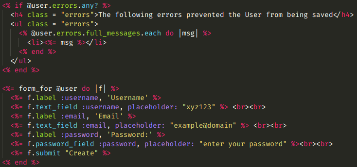

# Creating Forms with Rails

> Creating forms using HTML, form_tag and form_for

Additional description about the project and its features.

## Built With

- Rails
- Ruby

👤 **Azeem Ahmed**

- Github: [@Azeem838](https://github.com/Azeem838)

👤 Rajkumar Das

- Github: [@rajkumardas2701](https://github.com/rajkumardas2701)
- Twitter: [@Rajkuma58621299](https://twitter.com/Rajkuma58621299)
- Linkedin: [Rajkumar Das](https://www.linkedin.com/in/rajkumar-das-41308961/)

## 🤝 Contributing

Contributions, issues and feature requests are welcome!

Feel free to check the [issues page](https://github.com/Azeem838/re-former/issues).

## Show your support

Give a ⭐️ if you like this project!

## 📝 License

This project is [MIT](lic.url) licensed.
